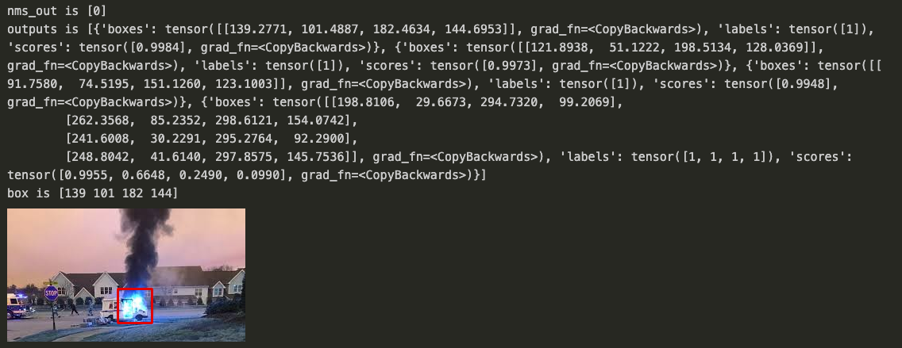

# Fire_Detection_Fast_RCNN

Research Paper - https://arxiv.org/pdf/1506.01497.pdf

In this project, downloaded 500 images from internet, used labellmg to create bounding boxes, wrote a custom datasets, data loaders, and transform-function (using Albumentation)  in pytorch, and trained on pre-trained ResNet50 model. Finally, evaluated model performance using mAP(Mean Average Precision) on different IOU. 

### Sample image with the bounding boxes

### Metrics

### Inference image with the bounding boxes

